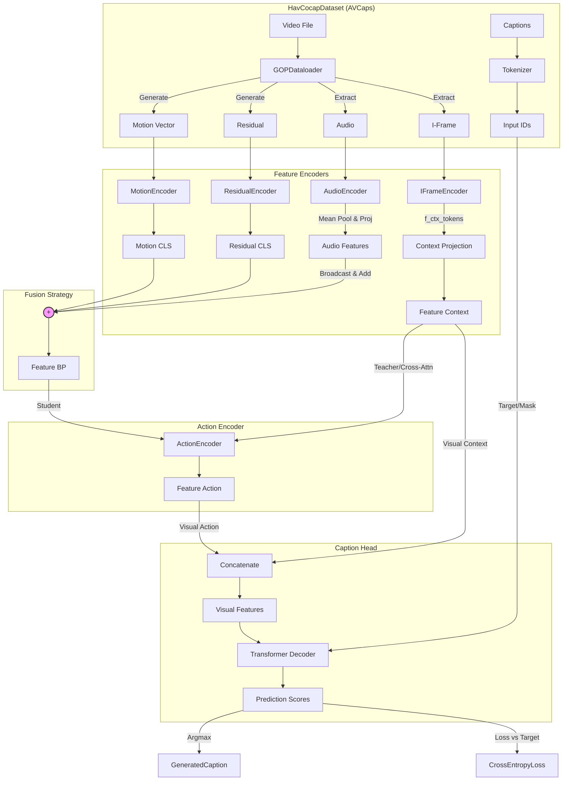

# Hav-Cocap Architecture Flow

This diagram illustrates the data flow and architectural components of the Hav-Cocap model with Audio Encoder integration.

```mermaid
graph TD
    subgraph Dataset ["HavCocapDataset (AVCaps)"]
        VideoFile[Video File] --> GOPLoader[GOPDataloader]
        GOPLoader --> |Extract| IFrame[I-Frame]
        GOPLoader --> |Extract| Audio[Audio]
        GOPLoader --> |Generate| Motion[Motion Vector]
        GOPLoader --> |Generate| Residual[Residual]
        Captions[Captions] --> Tokenizer[Tokenizer]
        Tokenizer --> InputIDs[Input IDs]
    end

    subgraph Encoders ["Feature Encoders"]
        IFrame --> IFrameEnc[IFrameEncoder]
        IFrameEnc --> |f_ctx_tokens| ContextProj[Context Projection]
        ContextProj --> FCtx[Feature Context]

        Audio --> BEATs[AudioEncoder]
        BEATs --> |Mean Pool & Proj| FAudio[Audio Features]

        Motion --> MotionEnc[MotionEncoder]
        Residual --> ResidualEnc[ResidualEncoder]
        
        MotionEnc --> MVCls[Motion CLS]
        ResidualEnc --> ResCls[Residual CLS]
    end

    subgraph Fusion ["Fusion Strategy"]
        MVCls --> SumNode((+))
        ResCls --> SumNode
        FAudio --> |Broadcast & Add| SumNode
        SumNode --> FBp[Feature BP]
        style SumNode fill:#f9f,stroke:#333,stroke-width:2px
    end

    subgraph ActionModeling ["Action Encoder"]
        FBp --> |Student| ActionEnc[ActionEncoder]
        FCtx --> |Teacher/Cross-Attn| ActionEnc
        ActionEnc --> FAct[Feature Action]
    end

    subgraph Captioning ["Caption Head"]
        FAct --> |Visual Action| Concat[Concatenate]
        FCtx --> |Visual Context| Concat
        Concat --> VisualFeats[Visual Features]
        
        VisualFeats --> TransformerDec[Transformer Decoder]
        InputIDs --> |Target/Mask| TransformerDec
        TransformerDec --> PredScores[Prediction Scores]
    end

    PredScores --> |Argmax| GeneratedCaption
    PredScores --> |Loss vs Target| CrossEntropyLoss
```
